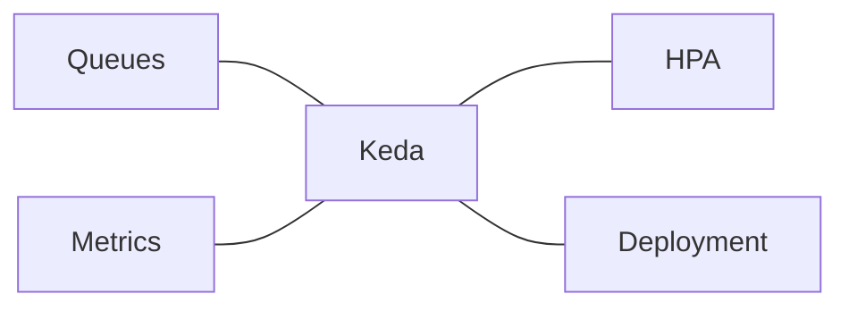

# Learning KEDA

## Introduction

### Purpose

KEDA autoscaler for Kubernetes and Container Apps.

Extends native k8s scaling to scale on any metrics from e.g. Prometheus, like calls per seconds.


### References

- [KEDA autoscaler for Kubernetes and Container Apps](https://www.youtube.com/watch?v=GTqdkQIdCXY)
- [Getting Started with KEDA](https://keda.sh/docs/2.19/)
- [Getting Started with Autoscaling in Kubernetes with KEDA](https://medium.com/@livewyer/getting-started-with-autoscaling-in-kubernetes-with-keda-210386e45488)
- [KEDA: Kubernetes Event-Driven Autoscaling](https://www.youtube.com/watch?v=3lcaawKAv6s)
  - [GitHub Gist - vfarcic/183-keda.sh](https://gist.github.com/vfarcic/2dad051fe41bd2bbcf94eda74386ce49)

- [The Best Performance And Load Testing Tool? k6 By Grafana Labs](https://www.youtube.com/watch?v=5OgQuVAR14I)
  - [load testing](https://k6.io/)
- [Kubernetes Notifications, Troubleshooting, And Automation With Robusta](https://www.youtube.com/watch?v=2P76WVVua8w)

### Vocabulary

- KEDA - Kubernetes Event Driven Autoscaler.
- HPA - Horizontal Pod Autoscaler.

### Overview





- Deployment - used for being able to set the deployment to 0.
- HPA - for scaling from 1 to N.
- Scale rule - e.g. if 5 msg in queue then scale containers.


## Testing it out in minikube

- minikube
- lgtm
- app container
- load generating container


- alias mk=minikube
- mk start

## K6 website performance test

- [Performance Testing your web app with k6](https://www.youtube.com/watch?v=Hu1K2ZGJ_K4)
  - [performance-testing-with-k6](https://github.com/cajames/performance-testing-with-k6)
- [How to do Performance Testing with k6](https://www.youtube.com/watch?v=ghuo8m7AXEM)

- TODO how to run the test
  - external from k8s, on machine with k6 installed.
  - external from k8s, in external container.
  - in a k6 container in the k8s cluster.
- TODO how to run test in a container in the cluster
- TODO how to work with APIs that uses tokens.
- TODO can I send the k6 metrics to an OLTP server?
- TODO look into the web browser plugin called 'Load impact' that should be able to generate a script the simulates what has happened in the browser.
- TODO use influxdb? to provide the k6 data to grafana.


### k6 vocabulary

- vu - Virtual user
  - An entity the executes a test and makes requests.
  - How many VUs = (numberOfHourlySessions x avgSessionDurationInSeconds)/3600
- Counter - cumulative sum. (how many times did it happen).
- Guage - the latest value.
- Rate - tracks the percentage of added values that are non-zero.
- Trend - provide: min, max, average, percentile. on the time series.
- Check - Just compare against expected, record it and move on.
- Tresholds - fails the test if the threshold is passed. It runs to the end but output error. TODO does it also return an error code?


### Anatomy of a test

- [Anatomy of a test](https://youtu.be/Hu1K2ZGJ_K4?si=e7tnrqhrXwU41KWO&t=816)

- initialize the code - imports, setup counters etc.
- `export const options` - optional - TODO it seems these things can be piped in via the cli.
  - Seting up thresholds
  - setting up number of VUs.
- `export function setup` - optional - e.g you need to create a user so you can use that user throughout the lifecycle of the test.
  - TODO seems to be per VU, I need to look into that.
- `export default function` - mandatory - every vu passes through this function
  - every vu will continuously run through this look, again and again.
- `export function teardown` - optional - e.g. delete the users created in setup.


Example snippet for docker-compose.yml

- [example](https://youtu.be/Hu1K2ZGJ_K4?si=xsO6VmLxWGCIPqaK&t=953)

Usage: `docker compose run k6 run /scripts/my_yest.js`

```yaml
  k6:
    build: .
    ports:
      - "6565:6565"
    volumes:
      - "./tests:/scripts"
    command: "version"
```


### TODO

TODO remember to '--build' if the rust app have been updatd.
docker compose up --build

- Implement api-emulator
  - create a couple of paths for quick and slow responses
  - create new test .js
- How to deploy to minikube.
- use kedra to scale the api-emulator.
